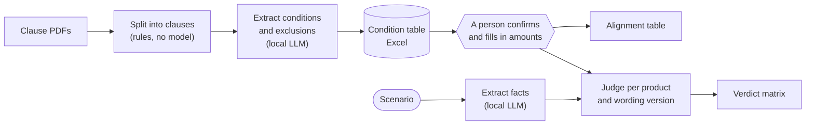

# travel-claims-agent

A local agent that turns travel-inconvenience insurance clauses (旅遊不便險) from several insurers into a reviewed table of claim conditions, then answers: *would this situation be paid, by which product, and under which clause?*

It runs entirely on one laptop with an 8 GB GPU. No document, prompt, or trace leaves the machine.

**Status:** the design is settled and the public corpus is collected. No application code is in the repository yet. The full specification is [issue #1](https://github.com/matthewhoung/travel-claims-agent/issues/1), and the [roadmap](#roadmap) shows what comes next.

---

## The problem

A property and casualty actuary compares the claim conditions of travel-inconvenience products from different insurers and uses the result as input to pricing. Today that means reading each clause document and lining the products up by hand. It is slow, and it is subjective: whether a situation is paid often depends on how the cause of the incident is classified, and two readers can classify it differently.

The actuary's working documents are unpublished drafts. They cannot go to a cloud service or out through any API, so whatever helps has to run locally with no outbound traffic.

[docs/DISCOVERY.md](docs/DISCOVERY.md) records the conversation this came from, what the request turned out to mean, and what is still unconfirmed.

## What it produces

Both examples below were written by hand from the collected documents to show the intended output. The system does not produce them yet.

### 1. Alignment table

One row per parameter, one column per product and wording version. The regulator's reference clauses changed on 2026-04-01, so the same product exists in an old and a new wording.

Flight delay (班機延誤), Cathay Century 享樂遊海外旅行綜合保險, old versus new wording:

| | Old wording | New wording |
|---|---|---|
| Delay measured until | the actual departure or the first replacement flight; the next replacement flight if force majeure (不可抗力) prevented taking the first | the actual departure of the flight or of the first replacement flight |
| Typhoon exclusion | none | excluded if a sea typhoon warning (海上颱風警報) was already issued when the policy was bought |
| Strike exclusion | strike already announced or under way | also excluded if the right to strike was already obtained or a strike period was pre-announced |

Benefit amounts are not in the clauses. They come from each insurer's plan table:

| Insurer | Plan | Flight delay, per 4 hours | Maximum per incident |
|---|---|---|---|
| Shinkong | Easy / B / C | NT$1,000 / 3,000 / 6,000 | NT$2,000 / 6,000 / 12,000 |
| Cathay Century | 安心型, 海外豪華型 | NT$6,000 | NT$12,000 |
| Fubon | PD1 to PD4 | NT$6,000 | NT$12,000 |

### 2. Scenario verdict matrix

A scenario is judged against every product and wording version. Each cell is a verdict (paid, not paid, or undetermined with a reason) plus the clause it rests on.

> 「投保時海上颱風警報已發布，之後去程班機因颱風延誤 6 小時。」
> *A sea typhoon warning was already in effect when the policy was bought. The outbound flight was later delayed 6 hours by the typhoon.*

| | Old wording | New wording |
|---|---|---|
| Cathay Century 享樂遊 | Paid: delay of 4 hours or more (第三十條) | Not paid: typhoon-warning exclusion (第三十一條 二) |

When the cause is unclear, the system does not pick one:

> 「班機延誤後，航空公司安排了第一班替代班機，但機場聯外道路封閉，我沒趕上，改搭下一班。」
> *After the delay the airline offered a first replacement flight. The road to the airport was closed, I missed it, and took the next one.*

| | New wording |
|---|---|
| Cathay Century 享樂遊 | **Undetermined: the cause is ambiguous.** Not taking the first replacement flight is excluded, unless force majeure (不可抗力) prevented it, and the clauses do not define that term (第三十一條 五). If the road closure counts as force majeure: paid. If not: not paid. |

If one incident triggers more than one condition in the same product, the matrix marks the overlap and says whether an aggregate limit in the clauses already resolves it.

## How it works



Three choices shape the design:

- **A person confirms the condition table before anything is answered from it.** The local model extracts. It does not decide. ([ADR 0001](docs/adr/0001-human-confirmed-condition-table.md))
- **Code does the arithmetic.** Thresholds, time windows, delay periods, amounts and limits are computed from the confirmed table. Besides reading the Scenario, the model judges one provision at a time, such as whether the facts fall within a covered event or under a specific exclusion, so the same input gives the same answer.
- **An unclear cause gives a conditional verdict.** The system shows the outcome under each reading and names the clause it turns on. ([ADR 0002](docs/adr/0002-conditional-verdict-when-cause-is-unclear.md))

[docs/ARCHITECTURE.md](docs/ARCHITECTURE.md) covers the pipeline, the table layout, and how the models share one 8 GB GPU. [CONTEXT.md](CONTEXT.md) defines the vocabulary.

## Evaluation

Expected answers come mainly from third parties, not from the author.

| Source | Items | Wording |
|---|---|---|
| Financial Ombudsman Institution decisions (金融消費評議中心), public and anonymised | about 25 (6 collected so far) | old |
| Non-Life Insurance Association Q&A on the 2026 wording | about 16 of its 35 items: those describing a situation under a judged benefit | new |
| Hand-written threshold cases, cross-checked with a second model | about 20 | both |

| Metric | What it measures |
|---|---|
| Verdict accuracy | is each cell of the matrix right |
| Conditionally correct | against a ruling, one branch of a conditional verdict matches and names the clause the ruling turned on; reported separately |
| Undetermined rate | how often the system declines to judge |
| Citation accuracy | share of expected Clauses the system cites |
| Extraction accuracy | share of extracted fields the reviewer did not have to change |
| Run-to-run consistency | the same document imported twice gives the same extracted fields; the same Scenario run three times gives the same outcome for every Condition |
| Retrieval and rerank on or off | whether they change verdict accuracy |
| 9B versus 4B | what a weaker machine would cost in accuracy |

### Results

*Filled in as runs complete.*

| Model | Verdict acc. | Cond. correct | Undetermined | Citation acc. | Extraction acc. | Consistency | VRAM peak (MB) | Decode tok/s |
|---|---|---|---|---|---|---|---|---|
| Qwen3.5-9B Q4_K_M | | | | | | | | |
| Qwen3.5-4B Q4_K_M | | | | | | | | |

## Scope

**In scope for the proof of concept**

- Three insurers and four Products: Cathay Century 享樂遊 (old and new wording) and 享暢行 (new wording only), Fubon 個人海外旅行不便保險 and Shinkong 個人海外旅行不便綜合保險 (old and new wording each).
- Alignment across all six standard benefits: trip cancellation, flight delay, trip change, baggage delay, baggage loss, and loss of travel documents.
- Scenario judging for flight delay, trip cancellation and trip change, where cause is most contested.

**Out of scope**

- Statistical dependence between events, which needs claims data.
- Parsing insurers' plan tables. Amounts are entered by hand with their source.
- Pausing a question to ask the user for a missing fact. The system reports what is missing and the user asks again.
- Authentication, multiple users, fine-tuning.

## Stack

| Layer | Choice | Pinned |
|---|---|---|
| Inference engine | llama.cpp `llama-server`, router mode | build **b11277**, CUDA 12.8, `sm_89` |
| LLM (primary) | Qwen3.5-9B, GGUF Q4_K_M | via `models.ini` |
| LLM (baseline) | Qwen3.5-4B, GGUF Q4_K_M | via `models.ini` |
| Embedder | voyage-4-nano (open weights, Apache-2.0), 1024-d | HF revision in lockfile notes |
| Reranker | bge-reranker-v2-m3 (CPU) | |
| Vector store | Qdrant, embedded (no server, no Docker) | `uv.lock` |
| Orchestration | LangGraph | `uv.lock` |
| Tracing | Arize Phoenix, self-hosted | `uv.lock` |
| Review and export | Excel workbook (.xlsx) | |
| Interface | Minimal web page bound to localhost | |
| Python | 3.12, managed by uv | `.python-version`, `uv.lock` |

**Hardware:** RTX 4060 Laptop GPU (8 GB, about 7.1 GB free with the Windows desktop running), 16 cores, WSL2 Ubuntu 24.04 with 15 GB RAM.

## Data

The corpus is public: 13 clause documents from 8 Taiwanese insurers, 6 ombudsman decisions, the industry Q&A, and a table of published benefit amounts. [data/SOURCES.md](data/SOURCES.md) lists where each file came from, with checksums.

- **The PDFs are not in the repository.** They are the insurers' documents. The source list is committed so the set can be rebuilt.
- **Public documents stand in for the customer's.** They are handled as if confidential so the architecture reflects the real deployment. Nothing in this repository is private data.
- **One step uses a cloud model, on public data only.** Evaluation items are drafted from public decisions and the public Q&A with a cloud model, then checked by a person against the originals. The customer's documents never leave the local machine and are never in this repository.

## Repository layout

```
travel-claims-agent/
├── README.md
├── CONTEXT.md               # vocabulary: Clause, Condition, Alignment, Overlap, Verdict, ...
├── docs/
│   ├── ARCHITECTURE.md      # pipeline, table layout, GPU scheduling, decision log
│   ├── DISCOVERY.md         # where the requirements came from
│   └── adr/                 # decisions that are hard to reverse
└── data/
    ├── SOURCES.md           # source URL and checksum for every file
    ├── amounts.csv          # published benefit amounts per plan
    ├── clauses/             # clause PDFs, git-ignored
    └── cases/               # ombudsman decisions and industry Q&A, git-ignored
```

Code, model presets and the evaluation runner arrive with the roadmap steps.

## Setup (WSL2)

Keep the project and models on WSL's own filesystem (`~/...`). Reading models across `/mnt/c` is several times slower.

### Inference engine (once per machine)

llama.cpp is a tool, not a project dependency. It lives in `~/tools`, shared by all projects and pinned to a tag.

Prerequisites: the NVIDIA driver on **Windows only** (never install a Linux driver inside WSL), plus the WSL-Ubuntu CUDA toolkit.

```bash
sudo apt install -y build-essential cmake git libcurl4-openssl-dev
# CUDA toolkit from NVIDIA's wsl-ubuntu repo (no driver included)
sudo apt install -y cuda-toolkit-12-8
export PATH=/usr/local/cuda/bin:$PATH

git clone https://github.com/ggml-org/llama.cpp ~/tools/llama.cpp
cd ~/tools/llama.cpp && git checkout b11277
cmake -B build -DGGML_CUDA=ON -DCMAKE_CUDA_ARCHITECTURES=89 -DCMAKE_BUILD_TYPE=Release
cmake --build build --config Release -j 6

~/tools/llama.cpp/build/bin/llama-server --list-devices   # expect CUDA0: RTX 4060 Laptop GPU
```

The Python environment, model download and run commands will be documented here as the code lands.

## Roadmap

- [x] Inference engine built (llama.cpp b11277, GPU visible from WSL)
- [x] Requirements and design settled; public corpus collected
- [ ] **Step 1:** split clause PDFs into clauses and import three insurers, two wordings each
- [ ] **Step 2:** extract conditions and exclusions to Excel, review them, measure extraction accuracy
- [ ] **Step 3:** produce the alignment table
- [ ] **Step 4:** draft and review the evaluation set
- [ ] **Step 5:** scenario judging and overlap marking
- [ ] **Step 6:** retrieval of general clauses; compare rerank on and off
- [ ] **Step 7:** full evaluation, 9B versus 4B
- [ ] **Step 8:** local web page, airplane-mode demo, add the remaining insurers without code changes, write-up
