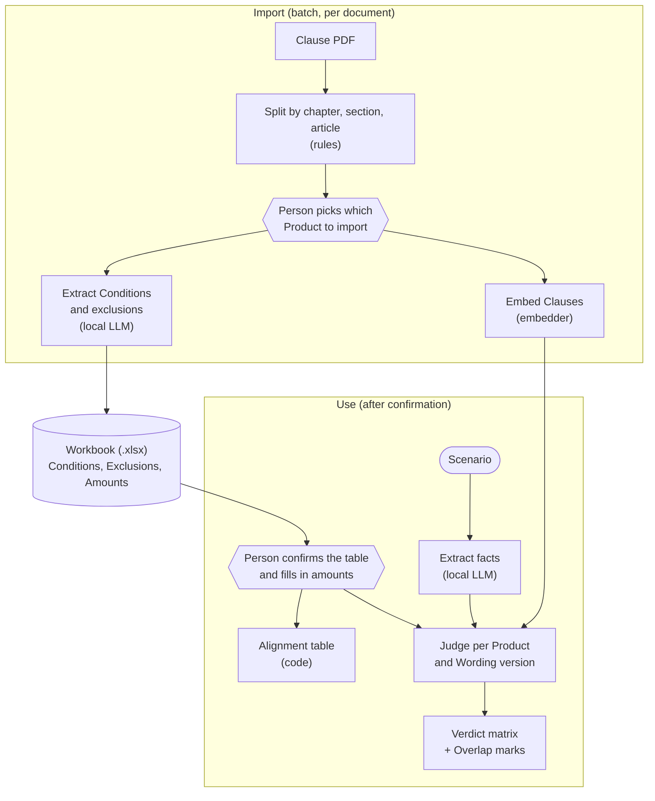
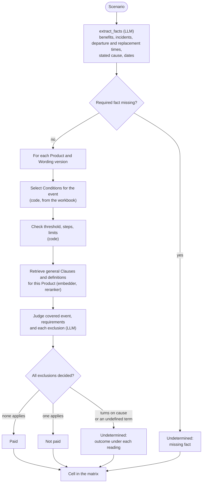
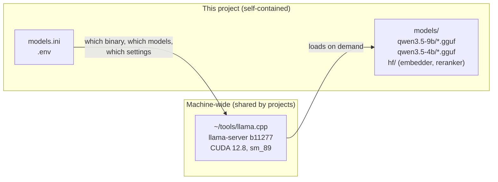
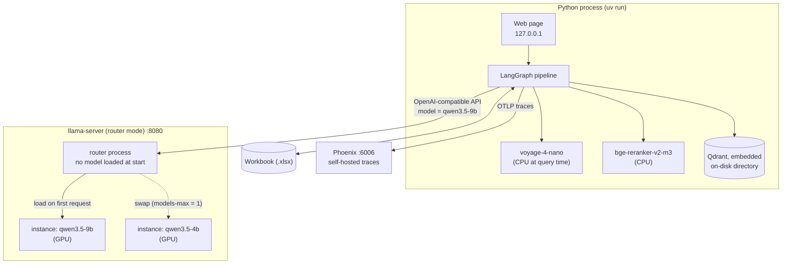

# Architecture

This document explains how the system is put together and why. The [README](../README.md) covers what it is for, [DISCOVERY.md](DISCOVERY.md) covers where the requirements came from, and [CONTEXT.md](../CONTEXT.md) defines the terms used here (Clause, Condition, Alignment, Overlap, Verdict and others).

Only splitting documents into Clauses (section 3.1) is implemented so far. Figures marked as estimates will be replaced by measurements.

## 1. Constraints

| Constraint | Consequence |
|---|---|
| The customer's documents are unpublished drafts that may not leave the machine | No cloud APIs, no hosted tracing, no network at runtime |
| The user needs comparisons that do not depend on one reader's interpretation | The model extracts; a person confirms; code computes |
| One laptop GPU, 8 GB (about 7.1 GB usable with Windows running) | Models cannot all sit on the GPU together; the GPU is time-shared |
| WSL2 on a Windows host | Project and models must live on the WSL filesystem; the GPU is shared with the Windows desktop |
| Proof of concept, single user | Sequential requests; no auth, no multi-tenancy |

## 2. Design principles

1. **Nothing leaves the machine.** Every service binds to `127.0.0.1`. Every model loads offline.
2. **The model extracts and a person confirms.** No verdict rests on an extraction nobody has looked at.
3. **Code does what code can do.** Splitting clauses, comparing numbers and applying limits use no model.
4. **Say what the answer turns on.** When a verdict cannot be given, the output names the missing fact, the ambiguous cause, or the silent clause.
5. **One GPU tenant at a time.** Consumer GPUs cannot partition VRAM, so isolation means scheduling, not slicing.
6. **Pin everything.** llama.cpp tag, CUDA version, Python version, package lockfile, model revisions.
7. **Evaluate before optimising.** Design choices are settled by the evaluation set, not by intuition.

## 3. Pipeline

The system has three stages. A person sits between the first and the other two.



### 3.1 Splitting documents into Clauses

Clause documents follow a fixed heading pattern: chapter (章), sometimes section (節), article (條), then numbered items. The splitter uses that pattern and no model.

Four things seen in the collected documents shape it:

- **One PDF can hold several policies and riders.** Clause numbers restart in each one, and the old and new wording of a Product reuse the same numbers, so a Clause is identified by Product, Wording version and Clause number together. The splitter lists the policies and riders it finds; a person picks which to import, names the Product and confirms its Wording version. A page range is the fallback when boundaries cannot be found.
- **A Product can be one chapter of a comprehensive travel policy.** Extraction covers the travel-inconvenience chapter and the general provisions (definitions, general exclusions, policy period). The other chapters are kept for retrieval only.
- **Body text refers to other articles** using the same 「第 X 條」 pattern as headings. The splitter must tell a heading from a cross-reference.
- **Extraction artefacts.** Some files are two-column, headings can break across lines, and spaces appear around full-width punctuation.

How the splitter deals with them:

- **Reading order.** The PDF reader looks for a vertical gutter in each page's word positions. A two-column page is read left column, then right column; a line that crosses the gutter splits the page into bands read in turn. Page numbers and running footers stay at the page edges, where the splitter removes them.
- **Characters.** Characters drawn twice at the same place (a way of faking bold) are dropped. Several PDFs encode common characters as CJK compatibility ideographs, such as 不 as U+F967, which look the same but do not match ordinary text; NFC normalisation turns them into ordinary characters and leaves full-width punctuation alone.
- **Heading or reference.** A heading sets its title off with a space or colon, and a reference that opens a line continues as a sentence (「第七十八條之急難事故時，…」). A line whose form leaves this open counts as a heading only if its number follows the previous heading's.
- **Policy boundaries and names.** A policy starts where Clause or chapter numbering restarts. Its name is the nearest title above: a line ending in 保險, 附加條款 or 附約, possibly with a plan type such as (甲型), possibly wrapped over up to three lines. A filing-number notice printed above the title at the top of a page belongs to the new policy, not to the previous policy's last Clause.
- **Wording version.** Suggested from the flight-delay exclusions: new when they mention a sea typhoon warning (海上颱風警報) and a right to strike already obtained (已取得罷工權), old otherwise. A policy with no flight-delay exclusions, such as a travel-accident policy in the same bundle, gets no suggestion.

### 3.2 The workbook

The workbook is the contract between the model and everything after it. It has three sheets.

**Conditions**, one row per Condition, filled by extraction:

| Column | Example |
|---|---|
| Condition key | flight delay |
| Product, Wording version | Cathay Century 享樂遊, new |
| Benefit | flight delay |
| Covered event | scheduled flight departs late |
| Coverage requirements | scheduled flight, as a passenger, within the policy period |
| Threshold | 4 hours |
| Delay-period rule | new-wording rule |
| Benefit type | progressive fixed amount, one-off fixed amount, or reimbursement |
| Step rule | for each full 4 hours |
| Aggregate limit group | the Conditions that share one limit, if a Clause states one |
| Clause reference | 第三十條 |

**Exclusions**, one row per excluded item, filled by extraction:

| Column | Example |
|---|---|
| Product, Wording version | Cathay Century 享樂遊, new |
| Exclusion type | typhoon warning at purchase |
| Applies to | one Condition, several, or all (general exclusions) |
| Text | verbatim from the Clause |
| Proviso | the exception to the exclusion, if any |
| Concerns cause | yes or no |
| Clause reference | 第三十一條 二 |

Exclusions get their own sheet because each one is judged and cited separately, and because most differences between the old and new wording are in the exclusions. Condition keys link the three sheets. Exclusion types come from a fixed list per Benefit, so the same exclusion can be lined up across Products and Wording versions even though item numbers shift between versions.

**Amounts**, one row per Condition and Plan, filled by a person:

| Column | Example |
|---|---|
| Condition key | flight delay |
| Plan | Shinkong Easy |
| Availability | published, not published, or not collected |
| Benefit amount | 1,000 (per step) |
| Maximum per incident | 2,000 |
| Source | URL of the plan table |

Amounts are entered by hand because clauses do not contain them and insurers publish them in incompatible layouts. For the public corpus they come from `data/amounts.csv`. Amounts for old wordings are no longer published, so those cells stay empty instead of borrowing current amounts.

The column list is a starting point and will be adjusted when extraction is built.

### 3.3 Alignment table

Once the workbook is confirmed, the Alignment table is produced by code: Condition parameters are lined up by Benefit, and exclusions by Benefit and exclusion type, across Products and Wording versions, with amounts per Plan alongside. An exclusion type missing from a column is shown as absent. No model is involved, so the table is reproducible.

### 3.4 Judging a Scenario



Who decides what:

| Step | Done by | Why |
|---|---|---|
| Read the Scenario into facts | LLM | free text |
| Pick the Conditions that cover the event | code | lookup in the confirmed workbook |
| Time windows, delay period, threshold, step count, amount, limits | code | arithmetic; must give the same answer every time |
| Find relevant general Clauses and definitions | embedder and reranker | some cases turn on a Clause outside the benefit's own article, such as the policy period |
| Do the facts fall within the covered event, and does each exclusion or proviso apply? | LLM, one provision at a time, with the Clause text | needs language understanding; the answer can also be that it turns on the Cause, needs a fact, or is not settled by the Clauses |
| Overlap | code | two or more Conditions paid for the same event in one Product; marked as resolved when they share an Aggregate limit |

In the old wording, the rule for measuring a flight delay has a force-majeure proviso: the delay runs to the next replacement flight if force majeure prevented taking the first. Code measures the delay under both readings, so the hours themselves can make an outcome Cause ambiguous.

There is one pass per question. The graph does not pause to ask for input. If a fact is missing, the output says which, and the user asks again. The extracted facts are shown with every answer so a misreading of the Scenario is visible.

**Verdict.** Each cell is one of:

- **Paid**, with the Condition and its Clause.
- **Not paid**, with the threshold, time window or coverage requirement that was not met, or the exclusion that applies.
- **Undetermined**, with exactly one reason: the cause is ambiguous, the Scenario lacks a fact, or the Clauses are silent. For an ambiguous cause the cell lists the outcome under each reading and the Clause it turns on.

The system does not use the model's self-rated confidence anywhere. See [ADR 0002](adr/0002-conditional-verdict-when-cause-is-unclear.md).

### 3.5 Retrieval

Retrieval has a narrow job: given the facts of a Scenario, find general Clauses and definitions in one Product and Wording version that bear on it. It never searches across Products or Wording versions, because a verdict is always about one Product in one Wording version, and a Product with long clauses would otherwise crowd out the others.

- **Unit:** one Clause per chunk, never split. Metadata: Product, Wording version, chapter, article number.
- **Pipeline:** dense search within the Product and Wording version, optional cross-encoder rerank, top results passed to the provision judgements.
- **Store:** Qdrant in embedded mode, a directory on disk with no server.
- **Embedding:** voyage-4-nano, 1024 dimensions.
- **Documented option, not a runtime path:** voyage-4-nano shares an embedding space with the hosted Voyage 4 models. If a customer's policy ever allowed an API, the query side could move to a larger model without re-indexing.

## 4. Local runtime

### 4.1 Three layers: tool, models, config



- **Tool layer.** The inference engine is installed once per machine and pinned to a tag. Several tags can live side by side in `~/tools`. Each project selects one through `.env`.
- **Model layer.** Weights belong to the project that uses them, not to a global cache. `HF_HOME` points to `models/hf/` so the embedder and reranker do not land in `~/.cache`.
- **Config layer.** `models.ini` defines each model's serving parameters. `.env` holds paths and the air-gap switches. Both are committed; `.env` is committed as `.env.example`.

### 4.2 Runtime topology



All arrows stay on `127.0.0.1`. The pipeline talks to the LLM through the OpenAI-compatible API, so switching models is a different `model` field in the request.

### 4.3 GPU scheduling and VRAM budget

The GPU has one tenant at a time. There are three modes and they never overlap.

| | Extraction (batch) | Indexing (batch) | Query (serving) |
|---|---|---|---|
| GPU tenant | one LLM instance via the router | voyage-4-nano (bf16) | one LLM instance via the router |
| Embedder | not used | GPU, batched | CPU, one query at a time |
| Reranker | not used | not used | CPU |
| Lifetime | runs per document, then idle | separate process, exits when done | long-running |

Indexing runs as its own process so that when it exits, all of PyTorch's cached GPU memory and the CUDA context go with it. Deleting a model inside a long-running Python process leaves a few hundred MB behind.

**VRAM budget, query mode** (estimates until the smoke test measures them):

| Item | MB | Source |
|---|---|---|
| Total | 8,187 | `--list-devices` |
| Windows desktop and other apps | ~1,100 | measured: 7,096 MB free |
| Qwen3.5-9B Q4_K_M weights | ~5,100 | published figure |
| KV cache + compute buffers at 8k context | TBD | smoke test |
| **Headroom target** | **≥ 300** | pass criterion |

Qwen3.5 uses a hybrid attention stack (three linear-attention layers per full-attention layer), so its KV cache grows much more slowly with context than a standard transformer's. That is the main reason 9B at 8k context is plausible on this card at all.

### 4.4 Model lifecycle (router mode)

llama-server starts **without** a model. The router reads `models.ini`, and each section defines one model. The first request that names a model loads it. With `--models-max 1`, requesting the other model unloads the current one first.

```ini
; models.ini (sketch)
[*]
n-gpu-layers = 99
jinja = 1
parallel = 1

[qwen3.5-9b]
model = models/qwen3.5-9b/Qwen3.5-9B-Q4_K_M.gguf
ctx-size = 8192

[qwen3.5-4b]
model = models/qwen3.5-4b/Qwen3.5-4B-Q4_K_M.gguf
ctx-size = 16384
```

The router is launched with `--models-preset models.ini --models-max 1 --host 127.0.0.1`. Models are listed explicitly in the preset rather than discovered with `--models-dir`, because `models/` also contains non-GGUF files (`hf/`) and explicit paths make the setup reviewable.

**Load time** is recorded as one number per model: the latency of the first request to an unloaded model, minus the latency of the same request once the model is warm.

**Known caveat.** A bug was reported in March 2026 where concurrent requests for different models could exceed `--models-max`. This proof of concept sends requests sequentially, and the evaluation runner never issues concurrent requests for different models.

### 4.5 Air-gap enforcement

| Risk | Control |
|---|---|
| LLM server reachable from the LAN | `--host 127.0.0.1` |
| Web page reachable from the LAN | bound to `127.0.0.1` |
| HF libraries phoning home | `HF_HUB_OFFLINE=1`, `TRANSFORMERS_OFFLINE=1`, `HF_HUB_DISABLE_TELEMETRY=1` |
| LangChain tracing to LangSmith | `LANGSMITH_TRACING=false`, `LANGCHAIN_TRACING_V2=false`; tracing goes to local Phoenix |
| Remote code in the embedder (`trust_remote_code`) | code reviewed once, revision pinned |
| A vector database service exposed on a port | none runs; Qdrant is embedded in the Python process |

**Proof:** the final demo runs the full pipeline, from PDF import to verdict matrix to trace, with the laptop in airplane mode.

## 5. Evaluation

### 5.1 Evaluation set

About 60 items. Most expected answers come from third parties.

| Source | Items | Wording | Notes |
|---|---|---|---|
| Financial Ombudsman Institution decisions | about 25 (6 collected so far) | old | Public and anonymised. Each quotes the clause and article it applies. Outcomes are skewed towards "not paid", so every decision in the claimant's favour is included. |
| Non-Life Insurance Association Q&A | about 16 of 35 | new | The items that describe a situation under a judged benefit. Baggage items only test the not-supported path. |
| Hand-written cases | about 20 | both | Threshold cases a non-expert can verify from the clause text, plus cases that should be undetermined. |

Rules for building it:

- **Items are drafted with a cloud model from public sources and checked by a person** against the original ruling or answer. The customer's documents are never involved.
- **A Scenario contains facts only.** The ombudsman's reasoning is left out, because including it would give away the answer.
- **An ombudsman item is used only if the clause it quotes matches a Product in the corpus**, so the expected verdict applies to the text being judged.
- **Hand-written cases are cross-checked by a second model**, and disagreements are re-read.
- The author is not a domain expert. The README says so.

### 5.2 Metrics

| Metric | Measures |
|---|---|
| Verdict accuracy | is each cell of the matrix right |
| Conditionally correct | against a ruling, one branch of a conditional verdict matches and the named Clause is the one the ruling turned on; reported separately from accuracy |
| Undetermined rate | how often the system declines to judge |
| Citation accuracy | are the cited Clauses the right ones |
| Extraction accuracy | share of extracted workbook fields the reviewer did not change |
| Run-to-run consistency | the same document imported twice gives the same extracted fields; the same Scenario run three times gives the same outcome for every Condition |
| Retrieval on/off, rerank on/off | effect on verdict accuracy |
| 9B versus 4B | accuracy cost of a smaller model |
| VRAM peak, decode speed, load time | cost of running it on this hardware |

## 6. Decision log

Decisions that are hard to reverse have their own records: [ADR 0001](adr/0001-human-confirmed-condition-table.md) (a confirmed condition table; code computes) and [ADR 0002](adr/0002-conditional-verdict-when-cause-is-unclear.md) (conditional verdicts).

| Decision | Alternatives | Why |
|---|---|---|
| Split clauses with rules | let the LLM segment the document | Heading patterns are regular; rules are exact and free. |
| pdfplumber to read PDFs | PyMuPDF, pypdf | Gives the character positions that two-column reading needs, under the MIT licence; PyMuPDF is AGPL. |
| Exclusions as separate rows | a text cell on each Condition | Each exclusion is judged and cited on its own; old and new wording differ mostly here. |
| Amounts entered by hand | parse plan tables | Layouts differ at every insurer and some publish none. |
| Retrieval within one Product | global top-k across insurers | A verdict is about one Product; global search lets long documents crowd out short ones. |
| Qdrant embedded | Qdrant in Docker | One fewer service to install and to expose. |
| No pause for user input | LangGraph `interrupt` with checkpointing | The human step moved to workbook confirmation; a missing fact is reported and the user asks again. |
| llama.cpp `llama-server` | Ollama, vLLM | Ollama picks context and slots for you; this project needs exact control of memory. vLLM pre-allocates GPU memory and suits dedicated servers, not a shared laptop GPU. |
| Router mode, `--models-max 1` | restart the server per model | On-demand loading and model switching without restarts; each instance is still its own process. |
| Qwen3.5-9B primary, 4B baseline | Qwen3.6 | Qwen3.6's smallest open models (27B dense, 35B-A3B MoE) need well over 8 GB. |
| voyage-4-nano | bge-m3, Qwen3-Embedding | Open weights, multilingual, and a shared embedding space with hosted Voyage 4 models. |
| Reranker on CPU | on GPU | Keeps the GPU for a single tenant at query time. |
| Phoenix | LangSmith, Langfuse | LangSmith is hosted. Langfuse needs Postgres and ClickHouse, too heavy for a laptop. |
| CUDA 12.8 | CUDA 13.x | Mature with gcc 13 and the llama.cpp build; avoids header-layout changes in 13.x with cmake 3.28. |
| uv + lockfile | pip + requirements.txt | Reproducible environments, pinned Python, torch from the CUDA index only. |

## 7. Known limitations and next steps

- **Validated on public documents only.** The system has not been run on the customer's drafts. They are said to resemble the public clause documents, which is why import is built to work on any document with the standard heading pattern.
- **Expected answers for the old wording come from rulings; for the new wording from an industry Q&A.** No ombudsman decision under the new wording exists yet.
- **No amounts for old wordings, and online plans only.** Plans sold offline are not published.
- **A 9B model has limits.** The design keeps it to extraction and single-provision judgements. The undetermined rate is reported so that caution is visible.
- **Hardware.** Developed and measured on one 8 GB laptop GPU. A machine without a comparable GPU would need the 4B model or CPU inference; the 9B versus 4B comparison shows the cost.
- **Single user, sequential.** Concurrency, auth and multi-tenancy are out of scope.
- **Not addressed:** statistical dependence between events, and relationships between Conditions other than a shared Aggregate limit.
- **Next steps:** pause to ask the user for a missing fact; other product lines; parsing plan tables; hybrid (sparse + dense) retrieval for exact article references; packaging the stack as an offline installer.
